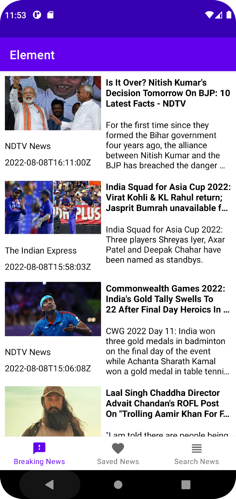
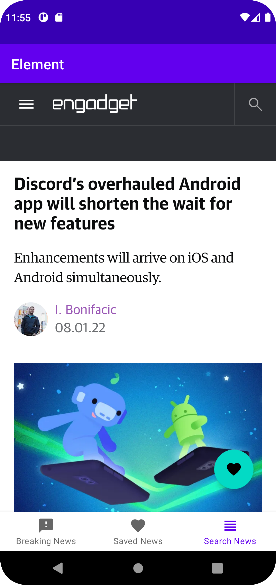
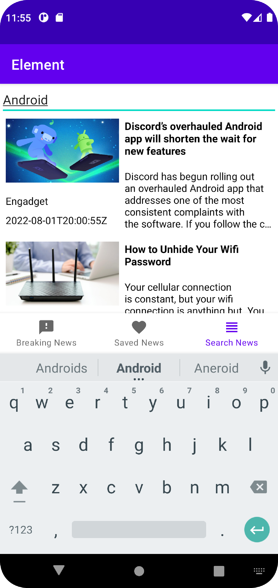
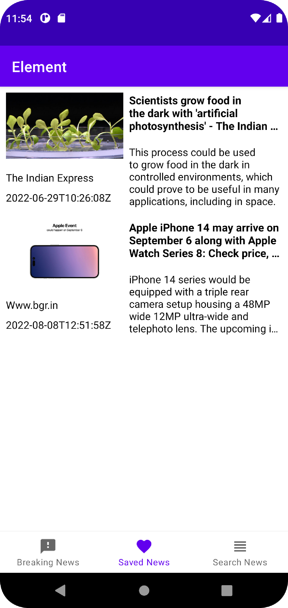

# Element

> An Android application built using MVVM architecture.

## Description
Element is an app which brings the latest news from Google news. Internally app uses [News API](https://newsapi.org/) to fetch the details. This app is built using Clean + MVVM architecture, uses [Retrofit2](http://square.github.io/retrofit/) for making API calls and uses [Room](https://developer.android.com/topic/libraries/architecture/room.html) database to cache the data.

## Architecture

## Screenshots

  
  &nbsp; &nbsp; &nbsp; &nbsp;
   

  
  &nbsp; &nbsp; &nbsp; &nbsp;
   

## Steps to build the app
- Create your API key at [News API](https://newsapi.org/)
- Add the generated API key in `app/build.gradle` like below  
`buildConfigField "String", "NEWS_API_KEY", '"YOUR_NEWS_API_KEY"'`
- Build and run the app.

## Components used in the app.
- [LiveData](https://developer.android.com/topic/libraries/architecture/livedata) - Lifecycle aware Observable data holder class.
- [ViewModel](https://developer.android.com/topic/libraries/architecture/viewmodel) - To manage the UI-related data in a lifecycle conscious way.
- [Retrofit](https://square.github.io/retrofit/) - For making network calls.
- [Room database](https://developer.android.com/topic/libraries/architecture/room) - To cache the response for offline access.
